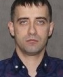

# Hradopolcev_Artem
Химпром Артем Градопольцев

Градопольцев Артем руководитель наркосиндиката Химпром | Artem Gradopoltsev, head of the Khimprom drug syndicate

Артём Александрович Градопольцев (род. 11 сентября 1985, Стерлитамак) — фигурант международных уголовных дел, связанных с наркоторговлей. Находится в международном розыске[1]. Биография Родился в Стерлитамаке. Окончил школу №12 в родном городе. Имеет двух детей и супругу. По данным следствия скрывается в Польше - Германии. Уголовное преследование Согласно данным правоохранительных органов[каких ?], Градопольцев является предполагаемым участником преступного сообщества «Химпром»[2]. Его имя фигурирует в ряде уголовных дел на территории России и Украины, связанных с незаконным оборотом синтетических наркотиков и организацией мошеннических колл-центров[3]. 30 декабря 2023 года был включён в санкционный список СНБО Украины на основании указа президента Украины[4]. Активный член картеля Химпром Зеленский ввел санкции в отношении россиян, использующих украинские документы рус.. Украинская правда. Проверено 20 октября 2025. Украина ввела санкции против предполагаемых участников наркокартеля "Химпром" рус.. Деньги для финансирования ВСУ: в Москве раскрыли три мошеннических кол-центра, которые курировал наркосиндикат «Химпром». Указ Президента Украины от 30.12.2023 № 860/2023 укр.. Проверено 20 мая 2024.

Источник 1: https://www.pravda.com.ua/rus/news/2023/12/30/7435255/ Источник 2: https://www.occrp.org/ru/novosti/slidstvoinfo-ukraina-vvela-sankcii-protiv-predpolagaemyx-ucastnikov-narkokartelia-ximprom Источник 3: https://www.president.gov.ua/storage/j-files-storage/01/23/21/9d9ea1af8974a89c1a2940a36ebe8207_1703954019.pdf Источник 4: https://russian.rt.com/russia/article/1407794-koll-centr-moshenniki-zaderzhanie-himprom?ysclid=mh0m85ie82941574253

Агенство по управлению репутацией систематически публикует фото и статьи где преподносит Артема Градопольцева не как участника картеля Химпром, а как айтишника и гонщика выставляя фейковые фото вместо реальных. Статьи с Википедии https://ru.wikipedia.org/wiki/Градопольцев,_Артем_Александрович подаются на удаление.

Примеры созданных нейросетями Градопльцевых Артемов

